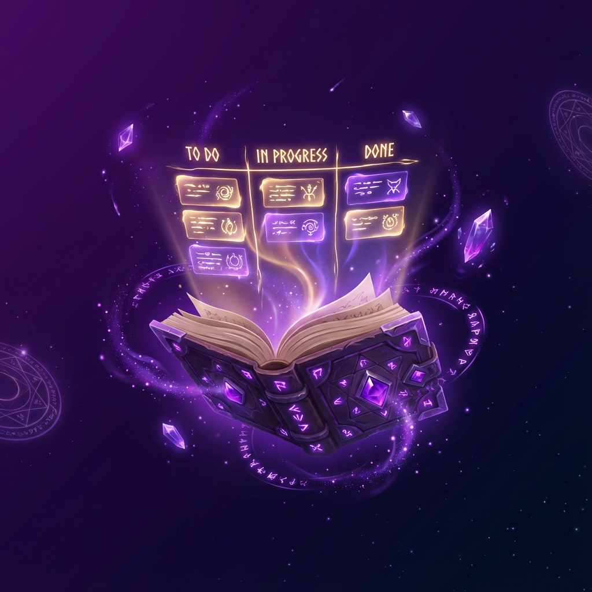
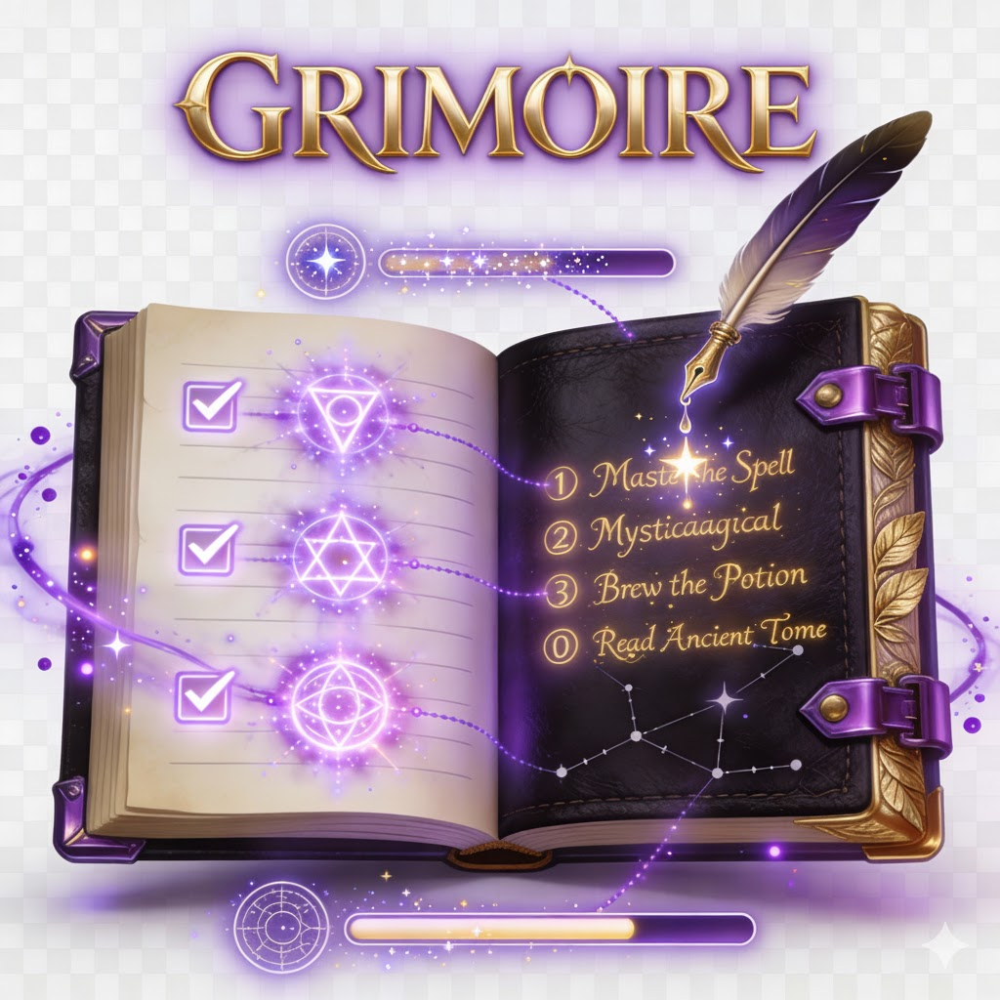

<div align="center">





### ✨ *Enchant your workflow. Illuminate the path to done.* ✨

*Where ancient wisdom meets modern productivity.*

[]()
[]()
[](LICENSE)

[]()
[]()
[]()
[]()
[]()

[📖 Read the Scrolls](#-the-ancient-scrolls-documentation) • 
[🎯 Begin Your Quest](#-summoning-ritual-installation) • 
[🔮 Discover Powers](#-mystical-powers-features) • 
[🌟 Join the Coven](#-join-the-coven-contributing)

</div>

---

## 📜 The Legend Begins...

**GRIMOIRE** is not just another task management app—it’s a mystical experience that turns your workflow into an enchanting journey. Built by wizards, for wizards who refuse to let productivity be ordinary.

### 🎭 What Makes This Grimoire Special?
- 🔮 Dark arts of productivity – obsidian UI with purple energy
- ⚡ Spell casting mechanics – celebratory effects on completion
- 🎮 XP & achievements – level up from *Apprentice* to *Grandmaster*
- 🎵 Arcane sound design (roadmap)
- ✨ Magical animations (roadmap)
- 🌙 Moonlit interface – dark by default
- ⌨️ Wizard shortcuts – command palette (Cmd/Ctrl+K) planned
- 📱 Portable grimoire – PWA readiness (roadmap)

---

## 🔮 Mystical Powers (Features)

### 🎯 Spell Management
- Create spells (tasks) with flair
- Drag & drop Kanban (planned DnD polish)
- Mastery status (complete)
- Grimoire Pages (boards)
- Spell Schools (lists)
- Rituals (recurring; roadmap)

### 🎮 Arcane Progression
- XP per mastered spell (roadmap)
- Achievements and ranks (roadmap)
- Daily streaks (roadmap)

### 🌙 Visual Enchantments
- Obsidian theme by default
- Particle effects and micro-animations (roadmap)
- Custom magical iconography (roadmap)

### ⚡ Power User Magic
- Keyboard wizardry (Cmd/Ctrl+K, J/K nav; roadmap)
- Instant search, runes/tags, prophecy dates (roadmap)

---

## 🎨 Glimpses into the Void (Screenshots)

<div align="center">

### 📖 The Grimoire Dashboard  
*(placeholder — add real capture soon)*


### 🎯 The Spell Casting Board  
*(placeholder — add real capture soon)*


</div>

---

## 📖 The Sacred Lexicon (Magic Terminology)

| 🚫 Mundane World | ✨ GRIMOIRE Realm | 🔮 Meaning |
|:---:|:---:|:---|
| Boards | **Grimoire Pages** | Sacred pages of your tome |
| Lists | **Spell Schools** | Magical disciplines |
| Tasks | **Spells** | Individual enchantments |
| Complete | **Mastered** | Spell successfully woven |
| Archive | **Sealed in the Vault** | Locked away |
| Due Date | **Prophecy Date** | When the spell must manifest |
| Recurring | **Ritual** | Repeating ceremony |
| Labels | **Runes** | Mystical symbols |
| Priority | **Spell Power** | Urgency of enchantment |

---

## 🎯 Summoning Ritual (Installation)

### Prerequisites
- Node.js 18+
- MongoDB
- npm or yarn

### Backend
```bash
cd backend
npm install
cp .env.example .env   # create this file using the keys below
# .env keys:
# PORT=5000
# MONGODB_URI=mongodb://localhost:27017/grimoire
# JWT_SECRET=change-me
# JWT_REFRESH_SECRET=change-me-too
# ACCESS_TOKEN_TTL=15m
# REFRESH_TOKEN_TTL=7d
# BCRYPT_SALT_ROUNDS=12
# CLEANUP_INTERVAL_MS=3600000
npm run dev
```

### Frontend
```bash
cd frontend
npm install
# Optional: REACT_APP_API_URL=http://localhost:5000
npm start
```

Visit `http://localhost:3000` to start casting spells.

---

## 🛠️ Arcane Architecture (Tech Stack)

**Frontend:** React 18 + TypeScript, axios, (planned) TailwindCSS, react-beautiful-dnd (to migrate), Framer Motion (planned), Zustand (planned)  
**Backend:** Node.js + Express, MongoDB/Mongoose, JWT + bcrypt, zod validation, token revocation store  
**DevOps:** GitHub Actions (planned), Docker Compose (planned), Vercel (FE) / Render (BE) (planned)

---

## 🗺️ The Prophecy (Roadmap)

### Q1 2026 - Foundation ⚡ IN PROGRESS
- [x] Branding + assets
- [x] Auth with JWT + refresh rotation + logout-all  
- [x] CRUD: pages (boards), spell schools (lists), spells (cards)
- [x] MongoDB + Express backend architecture
- [ ] Drag & drop with animations (50% - basic DnD working)
- [ ] XP/achievements (next priority)

### Q2 2026 - Enhancement
- [ ] Real-time collaboration (WebSockets)
- [ ] Advanced search & filters
- [ ] Custom runes/labels
- [ ] Calendar view (prophecy dates)
- [ ] Analytics dashboard
- [ ] Full i18n (EN/ES/FR)
- [ ] Magic link sharing
- [ ] Cover images & checklists

---

## 🌐 Live Demo

🚧 **Coming Soon** — currently in active development.  
For now, follow the [installation guide](#-summoning-ritual-installation) to run locally.

---

## 🌟 Join the Coven (Contributing)

1. Fork the Grimoire  
2. Branch: `git checkout -b feature/amazing-spell`  
3. Cast your spell (code)  
4. Test your magic  
5. Commit with runes: `git commit -m '✨ Add amazing spell'`  
6. Push and open a PR  

Guidelines: keep code in English, add tests where relevant, update docs when behavior changes.

---

## 📄 The Magical Contract (License)

MIT — see [LICENSE](LICENSE).

---

<div align="center">

### 🔮 Ready to enchant your workflow?

⭐ Star this repo if you believe in productivity magic! ⭐  

Made with 💜 by wizards, for wizards.

</div>
